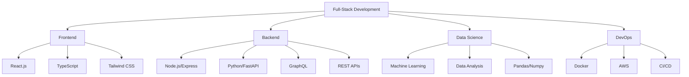

# 💻 Full-Stack Developer & Data Scientist

<div align="center">
  


**Building Scalable Solutions with Modern Tech Stack**

[](https://github.com/clevervi)
[](https://github.com/clevervi?tab=repositories)

</div>

## 🛠️ Tech Stack & Expertise



## 📊 GitHub Analytics

<div align="center">

|  |  |
|:---:|:---:|


</div>

## 🚀 Featured Projects

### **🤖 AI-Powered E-Commerce Platform**
```bash
Tech: React + TypeScript + Node.js + MySQL + ML Integration
```
- Real-time recommendation engine
- Microservices architecture with Docker
- Payment gateway integration
- **Live Demo:** [🔗 Project Link](https://)

### **📈 Advanced Analytics Dashboard**
```bash
Tech: Python + FastAPI + React + D3.js + PostgreSQL
```
- Real-time data visualization
- Predictive analytics models
- Automated reporting system
- **API Docs:** [🔗 Swagger](https://)

### **⚡ High-Performance Microservices**
```bash
Tech: Docker + Kubernetes + GraphQL + Redis + AWS
```
- Load-balanced architecture
- Auto-scaling capabilities
- Monitoring with Grafana/Prometheus
- **CI/CD:** GitHub Actions

## 🔧 Technical Proficiencies

### **Frontend Development**
<div align="center">
  


</div>

### **Backend & APIs**
<div align="center">


</div>

### **Data Science & ML**
<div align="center">


</div>

### **DevOps & Cloud**
<div align="center">


</div>

## 📈 Recent Activity

<!-- START_SECTION:activity -->
<!-- END_SECTION:activity -->

```python
class Developer:
    def __init__(self):
        self.name = "clevervi"
        self.role = "Full-Stack Developer & Data Scientist"
        self.location = "Unknown"
        self.passion = "Building innovative solutions"
    
    def current_focus(self):
        return ["Microservices Architecture", "Machine Learning", "Cloud Native Apps"]
    
    def technologies(self):
        return {
            "languages": ["Python", "JavaScript", "TypeScript", "SQL"],
            "frameworks": ["React", "Node.js", "FastAPI", "Express"],
            "tools": ["Docker", "AWS", "Git", "Kubernetes"]
        }

me = Developer()
```

## 🏆 GitHub Trophies

[](https://github.com/ryo-ma/github-profile-trophy)

## 📫 Let's Collaborate

<div align="center">

[](https://linkedin.com/in/your-profile)
[](https://your-portfolio.com)
[](mailto:your.email@example.com)
[](https://twitter.com/your-handle)

</div>

---

<div align="center">

### **🚀 "Code is poetry, data tells the story"**

⭐️ **From [clevervi](https://github.com/clevervi)** 

[](https://github.com/clevervi)

</div>

---

*💡 Always learning, always building. Open to new opportunities and collaborations.*
