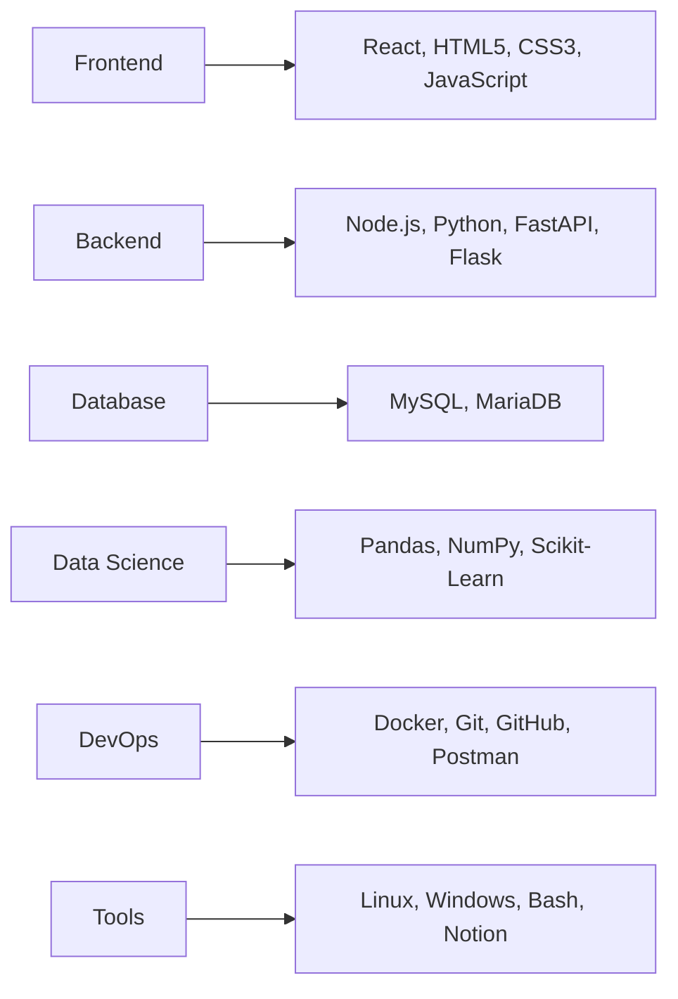

# 🚀 Full-Stack Developer & Data Scientist

  

## 🌟 Tech Galaxy - My Technical Universe

### **🌌 Frontend Cosmos**

  
  
  
  

### **⚡ Backend Nebula**

  
  
  
  

### **🗃️ Database Constellation**

  
  

### **📊 Data Science Universe**

  
  
  

### **🛠️ DevOps Toolkit**

  
  
  
  

## 📈 GitHub Universe Metrics

|  |  |
|:---:|:---:|

## 🎯 Featured Projects - My Digital Creations

### 🚀 **Cosmic E-Commerce**
**Tech Stack:** React, Node.js, MySQL, Docker  
A revolutionary e-commerce platform with real-time analytics and AI-powered recommendations.

### 📊 **Data Vision Dashboard**
**Tech Stack:** Python, Pandas, FastAPI, React  
Interactive data visualization platform transforming complex datasets into actionable insights.

### ⚡ **API Galaxy Microservices**
**Tech Stack:** Docker, Express, Flask, MySQL  
Scalable microservices architecture designed for high-performance API management.

## 🏆 Skills Matrix

## 🌐 Connect With Me Across the Digital Universe

---

**⭐️ From [Your Name](https://github.com/TU_USUARIO)** - *Coding the future, one commit at a time*

