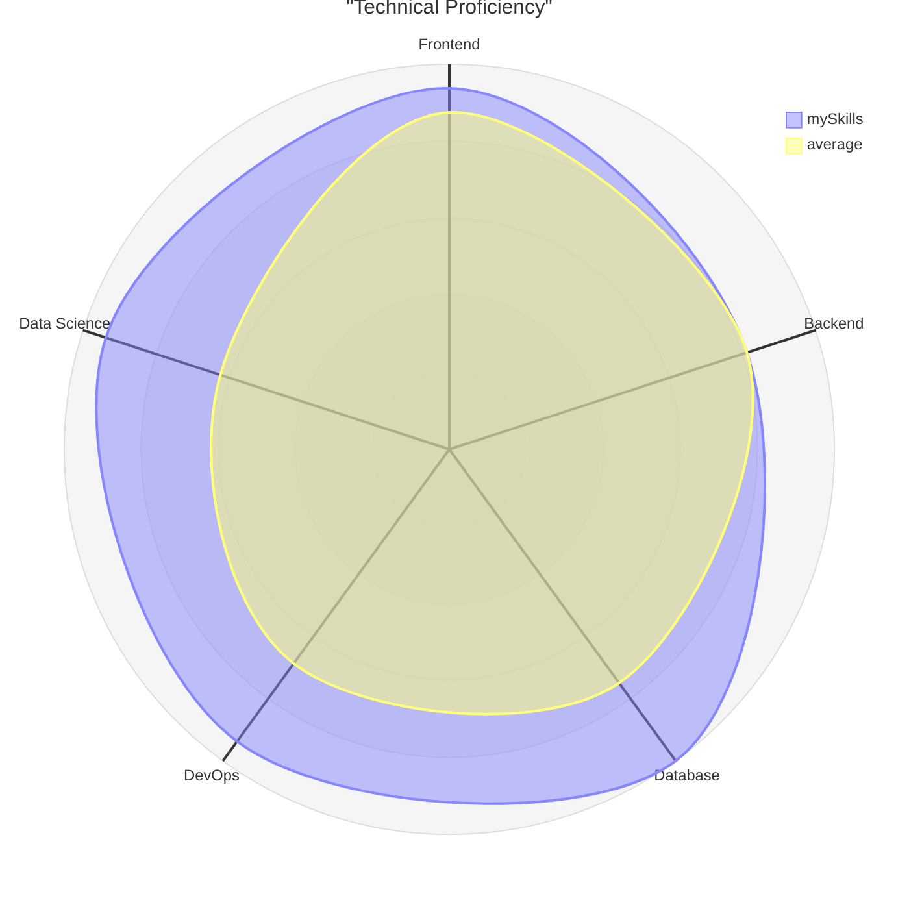

# 🚀 Full-Stack Developer & Data Scientist

  

## 🛠️ Technical Stack

### **Frontend Development**

  

### **Backend Development**

### **Databases**

### **Data Science & Machine Learning**

### **DevOps & Tools**

### **Productivity & OS**

## 📊 Skills Overview

## 📈 GitHub Statistics

|  |  |
|:---:|:---:|

## 🏆 Featured Projects

### 🌐 [E-Commerce Platform](https://github.com/TU_USUARIO/ecommerce-platform)
A full-stack e-commerce solution built with React, Node.js, and MySQL featuring user authentication, payment processing, and admin dashboard.

### 📊 [Data Analysis Dashboard](https://github.com/TU_USUARIO/data-dashboard)
Interactive data visualization platform using Python, Pandas, and React with machine learning integration for predictive analytics.

### 🚀 [API Microservices Architecture](https://github.com/TU_USUARIO/microservices-api)
Scalable microservices architecture using Docker, FastAPI, and Express with load balancing and automated deployment.

## 🎯 What I Do Best

- **Full-Stack Development**: Creating seamless user experiences with modern technologies
- **API Design & Development**: Building robust and scalable backend systems
- **Data Analysis & Visualization**: Transforming raw data into actionable insights
- **DevOps & Deployment**: Implementing CI/CD pipelines and cloud solutions
- **Problem Solving**: Creative solutions to complex technical challenges

<!--## 📫 Let's Build Something Amazing Together!

 -->

---

  

**⭐️ From [Your Name](https://github.com/TU_USUARIO)** - *Crafting digital excellence through code and creativity*

