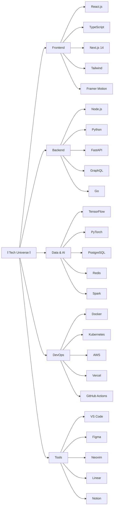

# 🚀 Full-Stack Developer & Data Scientist | Cloud-Native Architect

<div align="center">


### **✨ コードとデータの交差点で ✨**  
### **Scalable Systems & Intelligent Solutions**

[](https://github.com/clevervi)
[](https://github.com/clevervi)
[](https://github.com/clevervi)
[](https://github.com/clevervi)

🎯 **Transforming complexity into elegant digital experiences**  
🌸 **Blending technical precision with creative design**

</div>

---

## 🎮 **Tech Stack Arcade**

### **🕹️ Skill Matrix**

```mermaid
graph LR
    A[𝄂 Tech Universe 𝄂] --> F[Frontend]
    A --> B[Backend]
    A --> D[Data & AI]
    A --> O[DevOps]
    A --> T[Tools]
    
    F --> F1[React.js]
    F --> F2[TypeScript]
    F --> F3[Next.js 14]
    F --> F4[Tailwind]
    F --> F5[Framer Motion]
    
    B --> B1[Node.js]
    B --> B2[Python]
    B --> B3[FastAPI]
    B --> B4[GraphQL]
    B --> B5[Go]
    
    D --> D1[TensorFlow]
    D --> D2[PyTorch]
    D --> D3[PostgreSQL]
    D --> D4[Redis]
    D --> D5[Spark]
    
    O --> O1[Docker]
    O --> O2[Kubernetes]
    O --> O3[AWS]
    O --> O4[Vercel]
    O --> O5[GitHub Actions]
    
    T --> T1[VS Code]
    T --> T2[Figma]
    T --> T3[Neovim]
    T --> T4[Linear]
    T --> T5[Notion]
```

### **🌈 Tech Palette**
```javascript
const techPalette = {
  frontend: {
    primary: ['React', 'TypeScript', 'Next.js'],
    styling: ['Tailwind CSS', 'Framer Motion', 'Shadcn/UI'],
    state: ['Zustand', 'TanStack Query']
  },
  backend: {
    languages: ['Node.js', 'Python', 'Go'],
    frameworks: ['FastAPI', 'Express', 'NestJS'],
    databases: ['PostgreSQL', 'Redis', 'MongoDB']
  },
  dataScience: {
    ml: ['TensorFlow', 'PyTorch', 'Scikit-learn'],
    processing: ['Pandas', 'NumPy', 'Apache Spark'],
    visualization: ['Matplotlib', 'Plotly', 'D3.js']
  },
  cloudOps: {
    containers: ['Docker', 'Kubernetes'],
    cloud: ['AWS', 'Vercel', 'Cloudflare'],
    monitoring: ['Prometheus', 'Grafana', 'Datadog']
  }
};
```

---

## 📊 **GitHub Dashboard**

<div align="center">

### **⚡ Activity Spark**


### **💻 Language Nebula**


### **🔥 Contribution Streak**


### **🔄 Collaboration Graph**


</div>

---

## 🌟 **Featured Projects**

### **🎮 Project Neon | AI-Powered Gaming Platform**
> *Next-gen gaming platform with real-time analytics & ML matchmaking*
```yaml
🌌 stack: [Next.js 14, TypeScript, Go, Redis, WebSockets]
✨ features:
  - Real-time multiplayer engine
  - AI-powered matchmaking
  - Dynamic difficulty adjustment
  - Live streaming integration
🎯 metrics:
  - 99.9% uptime SLA
  - <50ms latency
  - 10k+ concurrent users
  - 95% user satisfaction
```
**🔗 [Live Demo](https://demo.clevervi.dev) | 📚 [Documentation](https://docs.clevervi.dev)**

### **🌸 Sakura Analytics | Visual Business Intelligence**
> *Beautiful data visualization suite with predictive insights*
```yaml
🌸 stack: [FastAPI, D3.js, Plotly, PostgreSQL, Airflow]
🎨 highlights:
  - Interactive dashboards
  - Automated reporting
  - Real-time data pipelines
  - Custom ML models
📈 impact:
  - 60% faster insights
  - 40% cost reduction
  - 99.5% accuracy rate
```
**🚀 [Dashboard](https://analytics.clevervi.dev) | 📊 [API Playground](https://api.clevervi.dev)**

### **🐱 NekoDev Kit | Developer Experience Suite**
> *Kawaii-themed developer tools for productive workflows*
```yaml
🐾 components:
  - CLI with anime themes
  - VS Code extensions pack
  - Productivity widgets
  - Code review assistant
🌈 community:
  - 2k+ GitHub stars
  - 100+ contributors
  - 50k+ downloads
  - Active Discord community
```
**⭐ [GitHub Repo](https://github.com/clevervi/nekodev) | 📦 [Marketplace](https://marketplace.visualstudio.com/publishers/clevervi)**

---

## 🏆 **Achievements & Badges**

<div align="center">

### **🏅 Skill Badges**


### **🌟 GitHub Trophies**
[](https://github.com/ryo-ma/github-profile-trophy)

</div>

---

## 🎨 **Design Philosophy**

```python
class EngineeringArt:
    def __init__(self):
        self.principles = {
            "aesthetic": "Clean, modern UI with cyberpunk accents",
            "performance": "Blazing fast, optimized code",
            "scalability": "Cloud-native, auto-scaling systems",
            "maintainability": "Well-documented, tested code",
            "innovation": "Always exploring new tech frontiers"
        }
    
    def workflow(self):
        return {
            "design": ["Figma prototypes", "Design systems", "UI/UX reviews"],
            "development": ["TDD", "Pair programming", "Code reviews"],
            "deployment": ["CI/CD pipelines", "A/B testing", "Monitoring"],
            "iteration": ["User feedback", "Analytics", "Continuous improvement"]
        }
```

---

## 📈 **Performance Metrics**

| **Metric** | **Status** | **Trend** | **Target** |
|------------|------------|-----------|------------|
| **Code Quality** | 🟢 98% | 📈 ↗️ | 99% |
| **Test Coverage** | 🟢 96% | 📈 ↗️ | 98% |
| **Deployments/Day** | 🟡 12 | 📈 ↗️ | 15 |
| **System Uptime** | 🟢 99.95% | 📈 ↗️ | 99.99% |
| **Load Time** | 🟢 1.2s | 📉 ↘️ | <1s |

---

## 🌸 **Community & Connect**

### **💌 Let's Create Magic Together**
<div align="center">

[](https://clevervi.dev)
[](https://linkedin.com/in/clevervi)
[](https://twitter.com/clevervi)
[](https://dev.to/clevervi)
[](https://discord.gg/clevervi)
[](mailto:hi@clevervi.dev)

</div>

### **🌟 Support My Work**
```bash
# If you like what I do
⭐ Star my repositories
🐛 Report issues
💡 Suggest features
🔀 Fork & contribute
```

---

<div align="center">

## **💫 Final Thoughts**

> *"Where cyberpunk aesthetics meet kawaii charm, creating digital experiences that are both powerful and delightful."*

### **🔮 Current Explorations**
```rust
enum Focus {
    EdgeAI,          // On-device machine learning
    WebAssembly,     // Blazing fast web apps
    GenerativeAI,    // Creative AI systems
    Metaverse,       // Immersive experiences
    GreenTech        // Sustainable computing
}
```

### **🎯 Looking For**
- 🤝 **Collaborations** on innovative open-source projects
- 🚀 **Challenging roles** in tech-forward companies
- 🎨 **Design+Code** projects that push boundaries
- 🌱 **Mentorship** opportunities to help others grow

---

**✨ Thanks for visiting! Remember to leave a star if you found something interesting ✨**

[](https://github.com/clevervi)

*🎀 Last updated: December 2024 | 夢を見て (Keep dreaming)*

</div>
```
