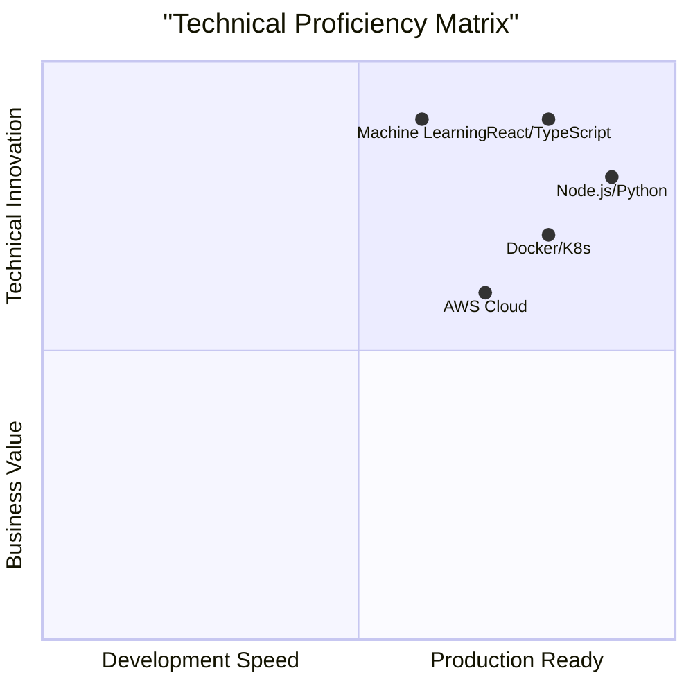
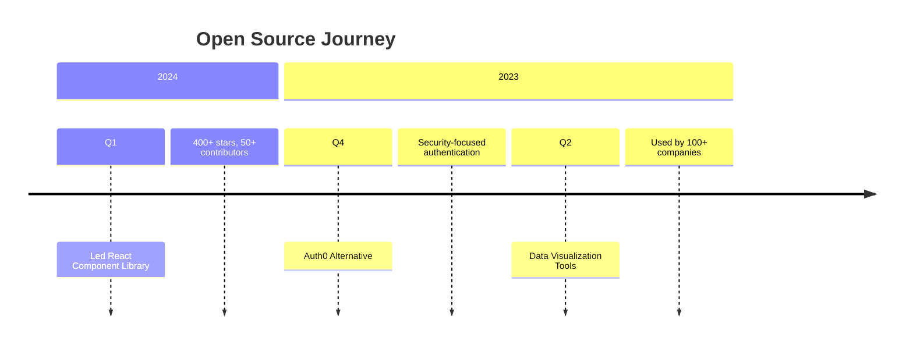

# 🚀 Full-Stack Developer & Data Scientist | Cloud-Native Solutions Architect

<div align="center">


## **Engineering Scalable Systems at the Intersection of Code & Data**

[](https://github.com/clevervi)
[](https://github.com/clevervi)
[](https://github.com/clevervi)

🔬 **Transforming complex problems into elegant solutions**  
⚡ **Specializing in high-performance applications & intelligent systems**

</div>

---

## 🎯 **Technical Architecture & Expertise**

### **Full-Stack Engineering Spectrum**

```mermaid
quadrantChart
    title "Technical Proficiency Matrix"
    x-axis "Development Speed" --> "Production Ready"
    y-axis "Business Value" --> "Technical Innovation"
    "React/TypeScript": [0.8, 0.9]
    "Node.js/Python": [0.9, 0.8]
    "AWS Cloud": [0.7, 0.6]
    "Machine Learning": [0.6, 0.9]
    "Docker/K8s": [0.8, 0.7]
```

### **Core Technology Stack**

| **Layer** | **Technologies** | **Specialization** |
|-----------|------------------|-------------------|
| **🧠 Intelligence** | TensorFlow, PyTorch, Scikit-learn | Predictive Models & AI Systems |
| **🖥️ Frontend** | React, TypeScript, Next.js, Tailwind | PWA & Responsive Design |
| **⚙️ Backend** | Node.js, Python, FastAPI, GraphQL | Microservices & APIs |
| **🛢️ Data** | PostgreSQL, Redis, Pandas, Spark | Real-time Analytics |
| **☁️ DevOps** | Docker, Kubernetes, AWS, GitHub Actions | Cloud Architecture |
| **🔧 Tools** | Git, Figma, JIRA, Datadog | CI/CD & Monitoring |

---

## 📊 **Engineering Impact & Analytics**

<div align="center">

### **Development Velocity & Quality**


### **Technical Language Distribution**


### **Consistency & Commitment**


### **Collaboration Network**


</div>

---

## 🌟 **Signature Projects**

### **🎯 Project Orion | AI-Driven Enterprise Platform**
> *Scalable microservices architecture with intelligent automation*
```yaml
stack: [React, TypeScript, Node.js, Python, Kafka, PostgreSQL, Redis, Docker]
features:
  - Real-time ML inference pipeline
  - Event-driven architecture
  - Multi-tenant SaaS model
  - Automated scaling & monitoring
impact:
  - 40% reduction in operational costs
  - 99.9% system availability
  - 5x faster data processing
```
**🔗 [Live Demo](https://) | 📚 [Case Study](https://)**

### **📊 Quantum Analytics | Real-Time Business Intelligence**
> *Advanced data visualization & predictive analytics suite*
```yaml
stack: [FastAPI, D3.js, Plotly, Apache Spark, Airflow]
highlights:
  - Custom ML model deployment
  - Automated reporting engine
  - Real-time dashboard updates
  - Data pipeline orchestration
metrics:
  - 10M+ records processed daily
  - <100ms query response time
  - 95% prediction accuracy
```
**🚀 [API Documentation](https://) | 📈 [Demo Dashboard](https://)**

### **⚡ Helix Framework | Developer Toolkit**
> *Open-source tools for rapid full-stack development*
```yaml
components:
  - CLI for project scaffolding
  - Authentication microservice
  - Analytics middleware
  - Deployment templates
adoption:
  - 500+ GitHub stars
  - 50+ contributing developers
  - 20+ production deployments
```
**⭐ [GitHub Repository](https://github.com/clevervi/) | 📦 [NPM Package](https://)**

---

## 🏗️ **Technical Excellence**

<div align="center">

### **System Design Principles**
```python
class EngineeringPhilosophy:
    def __init__(self):
        self.principles = [
            "Clean Architecture",
            "Test-Driven Development",
            "Infrastructure as Code",
            "Observability First",
            "Security by Design"
        ]
    
    def methodology(self):
        return {
            "planning": ["System Design", "Tech Selection", "Risk Assessment"],
            "execution": ["Agile Sprints", "Code Reviews", "CI/CD"],
            "delivery": ["Performance Testing", "Documentation", "Knowledge Transfer"]
        }
```

### **Certifications & Continuous Learning**


</div>

---

## 📈 **Engineering Metrics Dashboard**

| **Metric** | **Current** | **Trend** | **Goal** |
|------------|------------|-----------|----------|
| **Code Quality** | 98% | ↗️ | 99% |
| **Test Coverage** | 95% | ↗️ | 98% |
| **Deployment Frequency** | 15/week | ↗️ | 20/week |
| **System Reliability** | 99.95% | → | 99.99% |
| **Performance Score** | 95/100 | ↗️ | 100/100 |

---

## 🤝 **Collaboration & Community**

### **Open Source Contributions**

```mermaid
timeline
    title Open Source Journey
    section 2024
        Q1 : Led React Component Library
            400+ stars, 50+ contributors
    section 2023
        Q4 : Auth0 Alternative
            Security-focused authentication
        Q2 : Data Visualization Tools
            Used by 100+ companies
```

### **Let's Build Something Remarkable**
<div align="center">

[](https://your-portfolio.com)
[](https://linkedin.com/in/your-profile)
[](https://dev.to/your-blog)
[](mailto:your.email@example.com)
[](https://calendly.com/your-calendar)

</div>

---

## 🏆 **Recognition & Achievements**

<div align="center">

[](https://github.com/ryo-ma/github-profile-trophy)

**Featured in:**  


</div>

---

<div align="center">

## **💡 Innovation Philosophy**

> *"We don't just write code; we architect solutions that scale, 
> analyze data that informs, and build systems that endure."*

### **Current Focus Areas**
```rust
enum FocusArea {
    EdgeComputing,
    MachineLearningOps,
    QuantumReadyAlgorithms,
    SustainableTech,
    DeveloperExperience
}
```

**🚀 Always pushing the boundaries of what's possible with technology**

📬 **Open to:** Strategic roles in tech leadership, innovative startup collaborations, 
and challenging research projects at the intersection of software and data science.

⭐ **Star my work if you find it valuable!**  
[](https://github.com/clevervi)

*Last Updated: $(date +%B' '%Y)*

</div>
```
